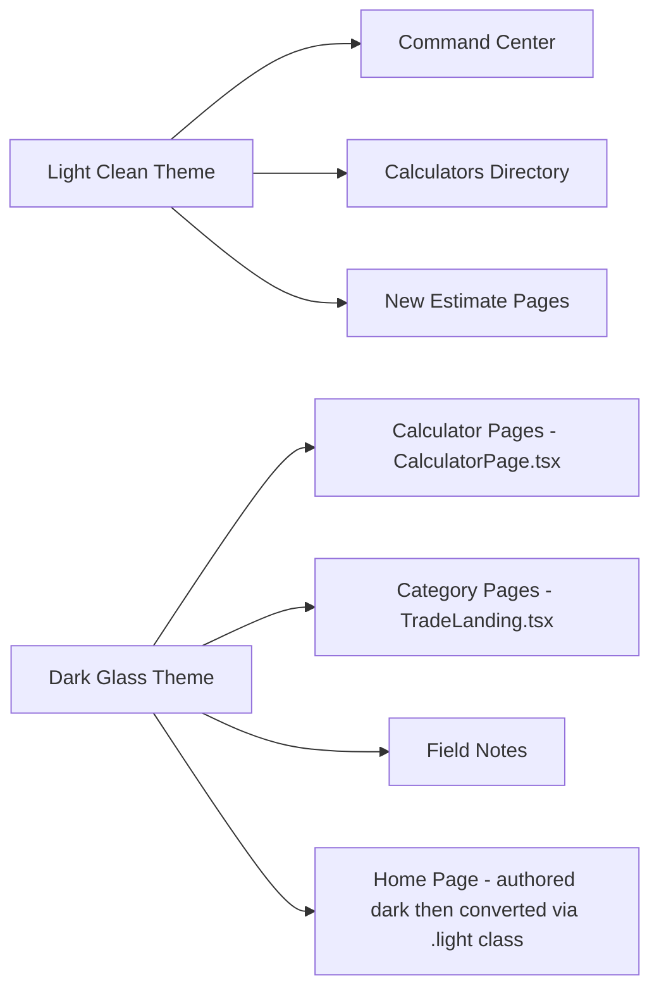
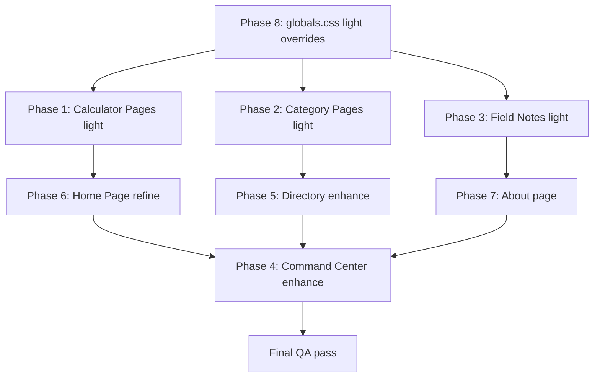

# UI/UX Design System Unification Plan

## Executive Summary

Unify the construction calculator app around a **light, clean, card-based design language** using the Command Center as the benchmark — while making tactical, CSS-level adjustments that avoid refactoring the 177K `CalculatorPage.tsx` monolith. The `.light` class override system already built in [`globals.css`](src/app/globals.css:232) provides the bridge mechanism.

---

## Current State Diagnosis

### Two Competing Themes



| Screen                | Current Theme          | Key File                                                                                 | Strategy                    |
| --------------------- | ---------------------- | ---------------------------------------------------------------------------------------- | --------------------------- |
| Command Center        | Light clean            | [`CommandCenterLiteClient.tsx`](src/app/command-center/CommandCenterLiteClient.tsx:1)    | Benchmark — enhance content |
| Calculators Directory | Light clean            | [`CalculatorsDirectoryClient.tsx`](src/app/calculators/CalculatorsDirectoryClient.tsx:1) | Enhance content density     |
| Calculator Pages      | Dark glass             | [`CalculatorPage.tsx`](src/app/calculators/_components/CalculatorPage.tsx:737)           | CSS override to light       |
| Category Pages        | Dark glass             | [`TradeLanding.tsx`](src/app/calculators/_components/TradeLanding.tsx:1)                 | CSS override to light       |
| Home Page             | Dark → .light override | [`page.tsx`](src/app/page.tsx:96)                                                        | Already converted; refine   |
| Field Notes           | Dark tokens            | [`field-notes/page.tsx`](src/app/field-notes/page.tsx:19)                                | Convert to light pattern    |
| New Estimate          | Light clean            | [`NewEstimateClient.tsx`](src/app/command-center/estimates/new/NewEstimateClient.tsx:1)  | Already aligned             |
| About                 | Mixed                  | [`about/page.tsx`](src/app/about/page.tsx:1)                                             | Convert to light pattern    |

### Why Light Wins

1. **Field readability** — Contractors use phones outdoors in bright sun. Light backgrounds with dark text yield better contrast
2. **The command center is the benchmark** — Already clean, well-structured, and modern
3. **`.light` override system already exists** — [`globals.css:232-262`](src/app/globals.css:232) already defines a complete light token set
4. **Reduces maintenance** — One visual language instead of two

---

## 1. Unified Design Direction

### Core Visual Tokens — The Unified Palette

All screens will use these shared design primitives, defined via the existing `.light` class in [`globals.css`](src/app/globals.css:232):

| Token             | Value                                                               | Usage                          |
| ----------------- | ------------------------------------------------------------------- | ------------------------------ |
| Background        | `#fff7ed` warm cream                                                | Page shell bg via `--color-bg` |
| Card bg           | `white` / `rgb(255 255 255 / 0.76)`                                 | All card surfaces              |
| Card border       | `border-slate-300` / `rgb(148 163 184 / 0.4)`                       | Default card borders           |
| Card border hover | `border-orange-500/50` or `border-orange-300`                       | Interactive hover              |
| Card radius       | `rounded-2xl` (1rem / 16px)                                         | All cards, consistent          |
| Card shadow       | `shadow-sm`                                                         | Subtle depth                   |
| Primary accent    | `orange-600` (#ea580c)                                              | CTAs, kickers, icons           |
| Text primary      | `text-slate-900`                                                    | Headings                       |
| Text secondary    | `text-slate-600`                                                    | Body, descriptions             |
| Text tertiary     | `text-slate-500`                                                    | Hints, labels                  |
| Kicker style      | `text-[10px] font-bold uppercase tracking-[0.16em] text-orange-600` | Section headers                |
| Display font      | `font-display` (Oswald) uppercase                                   | Major headings                 |
| Body font         | Inter                                                               | All body text                  |
| Spacing unit      | `gap-3` (12px) between cards                                        | Consistent rhythm              |

### Card Component Pattern

The benchmark card pattern from [`CommandCenterLiteClient.tsx:170`](src/app/command-center/CommandCenterLiteClient.tsx:170):

```html
<!-- Standard card -->
<article
  class="rounded-2xl border border-slate-300 bg-white px-4 py-4 shadow-sm sm:px-5"
>
  <p class="text-[10px] font-bold uppercase tracking-[0.16em] text-orange-600">
    Section kicker
  </p>
  <!-- card content -->
</article>

<!-- Interactive card (links/clickable) -->
<a
  class="rounded-xl border border-slate-200 bg-slate-50 px-3 py-3 transition hover:border-orange-300 hover:bg-orange-50"
>
  <!-- content -->
</a>

<!-- Metric card -->
<article
  class="rounded-2xl border border-slate-300 bg-white px-4 py-3 shadow-sm"
>
  <p class="text-[10px] font-bold uppercase tracking-[0.16em] text-slate-500">
    Label
  </p>
  <p class="mt-1 text-2xl font-black text-slate-900">Value</p>
</article>
```

### Button Patterns

```html
<!-- Primary CTA -->
<button
  class="inline-flex min-h-11 items-center justify-center gap-2 rounded-xl bg-orange-600 px-4 py-2 text-xs font-black uppercase tracking-[0.1em] text-white transition hover:bg-orange-700"
>
  Action <ArrowRight />
</button>

<!-- Secondary / Ghost -->
<button
  class="inline-flex min-h-11 items-center justify-center rounded-xl border border-slate-300 bg-slate-50 px-4 py-2 text-xs font-semibold uppercase tracking-[0.1em] text-slate-700 transition hover:border-orange-400 hover:text-orange-700"
>
  Secondary
</button>

<!-- Chip / Tag -->
<span
  class="rounded-full border border-slate-300 bg-white px-3 py-1 text-[11px] font-semibold text-slate-700"
>
  Tag
</span>
```

### Form Input Styles

```html
<!-- Standard input in light context -->
<input
  class="w-full rounded-xl border border-slate-300 bg-white px-3 py-2.5 text-sm text-slate-900 placeholder:text-slate-500 outline-none focus:border-orange-500 focus:ring-1 focus:ring-orange-500"
/>

<!-- Search input with icon -->
<div
  class="flex items-center rounded-xl border border-slate-300 bg-slate-50 px-3 py-2 focus-within:border-orange-500 focus-within:ring-1 focus-within:ring-orange-500"
>
  <search class="h-3.5 w-3.5 text-slate-400" />
  <input
    class="ml-2 flex-1 bg-transparent text-sm text-slate-900 placeholder:text-slate-500 outline-none"
  />
</div>
```

---

## 2. Implementation: Phase-by-Phase

### Phase 1: Calculator Pages — Light Override (Highest Impact)

**Goal:** Bring all calculator pages into the light theme without touching the 177K `CalculatorPage.tsx` component internals.

**Mechanism:** The `.light` class system in [`globals.css:232-362`](src/app/globals.css:232) already converts dark Tailwind classes (bg-slate-900, text-white, border-slate-800) to their light equivalents. The strategy:

#### Step 1A: Apply `.light` class to calculator shell

In [`CalculatorPage.tsx:2894-2901`](src/app/calculators/_components/CalculatorPage.tsx:2894), the main element has:

```tsx
className={`command-theme flex min-h-0 flex-1 flex-col overflow-hidden animated-gradient-bg text-white ...`}
```

**Change:** Add `light` class to the `<main>` element classname string:

```tsx
className={`light command-theme flex min-h-0 flex-1 flex-col overflow-hidden text-white ...`}
```

Also remove `animated-gradient-bg` — it produces the dark animated gradient background that conflicts with light mode.

#### Step 1B: Disable animated gradient background for light

In [`globals.css`](src/app/globals.css), find the `.animated-gradient-bg` class and add a `.light` override:

```css
.light .animated-gradient-bg,
.light.animated-gradient-bg {
  background: var(--color-bg) !important;
  animation: none !important;
}
```

Or simply remove the `animated-gradient-bg` class from the calculator shell in the className change above.

#### Step 1C: Fix calculator-specific dark patterns

The existing `.light` overrides in [`globals.css:318-366`](src/app/globals.css:318) already handle:

- `bg-slate-950/*` → warm cream
- `bg-slate-900/*` → white/76%
- `bg-slate-800/*` → white/58%
- `border-slate-800/700/600/500` → slate transparent
- `text-slate-100/200/white` → dark text
- `text-slate-300/400` → secondary dark text

**Additional overrides needed** for calculator-specific patterns — add to [`globals.css`](src/app/globals.css):

```css
/* Calculator light overrides */
.light .bg-surface-deep,
.light .bg-surface-base,
.light .bg-surface-elevated {
  background: rgb(255 255 255 / 0.76) !important;
}

.light .border-white\/10,
.light .border-white\/5,
.light .border-white\/15,
.light .border-white\/20 {
  border-color: rgb(148 163 184 / 0.35) !important;
}

.light .shadow-\[0_18px_40px_rgba\(0\,0\,0\,0\.35\)\] {
  box-shadow:
    0 1px 2px 0 rgba(0, 0, 0, 0.05),
    0 1px 3px 0 rgba(2, 6, 23, 0.1) !important;
}

.light .text-orange-400 {
  color: #ea580c !important;
}

.light .bg-black\/30,
.light .bg-black\/25 {
  background: rgb(241 245 249 / 0.5) !important;
}
```

#### Step 1D: Calculator page background

Replace the dark gradient page background. In the calculator shell, instead of `animated-gradient-bg`, use:

```tsx
className={`light command-theme page-shell flex min-h-0 flex-1 flex-col overflow-hidden ...`}
```

The `.page-shell` class in [`globals.css:782-789`](src/app/globals.css:782) already provides a subtle warm gradient on the bg.

#### Files to modify:

| File                                                                                      | Change                                                               |
| ----------------------------------------------------------------------------------------- | -------------------------------------------------------------------- |
| [`CalculatorPage.tsx:2894-2901`](src/app/calculators/_components/CalculatorPage.tsx:2894) | Add `light page-shell`, remove `animated-gradient-bg` from className |
| [`globals.css`](src/app/globals.css)                                                      | Add calculator-specific light overrides (~20 lines)                  |

---

### Phase 2: Category Pages (TradeLanding) — Light Override

**Goal:** Convert dark category landing pages to the clean light pattern.

The [`TradeLanding.tsx:80-83`](src/app/calculators/_components/TradeLanding.tsx:80) tile component uses:

```tsx
className =
  "group relative snap-start rounded-2xl border border-white/10 bg-[radial-gradient(...)] p-4 text-white shadow-[0_18px_40px_rgba(0,0,0,0.35)]";
```

#### Step 2A: Add `.light` class to TradeLanding shell

Find the `<main>` or outermost shell element in `TradeLanding.tsx` and add the `light` class.

#### Step 2B: Override tile dark styles

The existing `.light` overrides handle most of the dark-to-light conversion. The `radial-gradient` inline background on tiles needs specific handling:

```css
/* TradeLanding tile overrides in light mode */
.light [aria-label*="calculator tile"] {
  background: white !important;
  border-color: rgb(203 213 225) !important;
  color: var(--color-text-primary) !important;
  box-shadow: 0 1px 2px 0 rgba(0, 0, 0, 0.05) !important;
}

.light [aria-label*="calculator tile"]:hover {
  border-color: rgb(249 115 22 / 0.5) !important;
  background: rgb(255 247 237) !important;
}

.light [aria-label*="calculator tile"] .text-white {
  color: var(--color-text-primary) !important;
}
```

**Better approach:** Modify the `TradeTile` component directly — replace dark classes with the unified card pattern. This is a ~30-line JSX change in the [`TradeTile` function](src/app/calculators/_components/TradeLanding.tsx:71):

```tsx
// FROM:
className =
  "group relative snap-start rounded-2xl border border-white/10 bg-[radial-gradient(...)] p-4 text-white shadow-[0_18px_40px_rgba(0,0,0,0.35)] transition-transform duration-200 hover:-translate-y-0.5";

// TO:
className =
  "group relative snap-start rounded-2xl border border-slate-300 bg-white p-4 text-slate-900 shadow-sm transition-all duration-200 hover:border-orange-500/50 hover:bg-orange-50 hover:-translate-y-0.5";
```

And update text classes inside TradeTile: `text-white` → `text-slate-900`, `text-[--color-nav-text]` → `text-slate-500`, etc.

#### Files to modify:

| File                                                                   | Change                                                        |
| ---------------------------------------------------------------------- | ------------------------------------------------------------- |
| [`TradeLanding.tsx`](src/app/calculators/_components/TradeLanding.tsx) | Update TradeTile className + inner text colors (~15-20 lines) |
| [`TradeLanding.tsx`](src/app/calculators/_components/TradeLanding.tsx) | Add `light` class to shell element                            |

---

### Phase 3: Field Notes — Light Conversion

**Goal:** Convert field notes from dark tokens to the light card pattern.

The [`field-notes/page.tsx:19`](src/app/field-notes/page.tsx:19) uses:

```tsx
<div className="page-shell flex min-h-dvh flex-col bg-[var(--color-bg)]">
```

Cards use `border-white/10 bg-[var(--color-surface)]` — dark-themed tokens.

#### Changes:

Replace dark token references with explicit light classes matching the command center pattern:

```tsx
// Shell
<div className="light page-shell flex min-h-dvh flex-col bg-[var(--color-bg)]">

// Hero card - FROM:
className="rounded-2xl border border-white/10 bg-[var(--color-surface)] p-5 shadow-[0_10px_30px_rgba(0,0,0,0.15)]"
// TO:
className="rounded-2xl border border-slate-300 bg-white p-5 shadow-sm"

// Article cards - FROM:
className="... rounded-2xl border border-white/10 bg-[var(--color-surface)] p-4 shadow-[0_10px_30px_rgba(0,0,0,0.12)]"
// TO:
className="... rounded-2xl border border-slate-300 bg-white p-4 shadow-sm transition hover:border-orange-300"
```

Update text colors: `text-orange-500` → `text-orange-600`, `text-[--color-ink]` → `text-slate-900`, `text-[--color-ink-dim]` → `text-slate-600`.

Similarly for [`field-notes/[slug]/page.tsx`](src/app/field-notes/[slug]/page.tsx).

#### Files to modify:

| File                                                                 | Change                                    |
| -------------------------------------------------------------------- | ----------------------------------------- |
| [`field-notes/page.tsx`](src/app/field-notes/page.tsx)               | Convert to light card classes (~20 lines) |
| [`field-notes/[slug]/page.tsx`](src/app/field-notes/[slug]/page.tsx) | Convert to light card classes             |

---

### Phase 4: Command Center Enhancement

**Goal:** The command center is clean but sparse. Add meaningful content and structure.

Current layout from [`CommandCenterLiteClient.tsx:169-377`](src/app/command-center/CommandCenterLiteClient.tsx:169):

```
┌────────────────────────────────────────┐
│ Header: Business Name + CTAs           │
├──────┬──────┬──────┬──────────────────┤
│ Team │Signed│Draft │ Role              │  ← stat cards
├──────┴──────┴──────┴──────────────────┤
│ Quick Access 2x3 grid | Crew Access    │
├────────────────────────────────────────┤
│ Recent Estimates grid                  │
└────────────────────────────────────────┘
```

#### Enhancement Plan:

**Add these new sections/improvements:**

##### 4A. Quick Action Bar (below header, above stats)

Add a prominent horizontal action strip for the #1 workflows:

```tsx
<div className="grid gap-2 sm:grid-cols-3">
  <Link
    href={routes.newEstimate}
    className="rounded-2xl border border-orange-200 bg-orange-50 px-4 py-3 transition hover:bg-orange-100"
  >
    <div className="flex items-center gap-2">
      <PlusCircle className="h-5 w-5 text-orange-600" />
      <div>
        <p className="text-sm font-bold text-slate-900">New Estimate</p>
        <p className="text-[11px] text-slate-600">
          Start from scratch or a calculator
        </p>
      </div>
    </div>
  </Link>
  <Link
    href={routes.calculators}
    className="rounded-2xl border border-slate-200 bg-slate-50 px-4 py-3 transition hover:border-orange-300 hover:bg-orange-50"
  >
    <div className="flex items-center gap-2">
      <Calculator className="h-5 w-5 text-orange-600" />
      <div>
        <p className="text-sm font-bold text-slate-900">Open Calculators</p>
        <p className="text-[11px] text-slate-600">Run a quick takeoff</p>
      </div>
    </div>
  </Link>
  <Link
    href={routes.saved}
    className="rounded-2xl border border-slate-200 bg-slate-50 px-4 py-3 transition hover:border-orange-300 hover:bg-orange-50"
  >
    <div className="flex items-center gap-2">
      <FileText className="h-5 w-5 text-orange-600" />
      <div>
        <p className="text-sm font-bold text-slate-900">Saved Estimates</p>
        <p className="text-[11px] text-slate-600">Resume or send a quote</p>
      </div>
    </div>
  </Link>
</div>
```

##### 4B. Enhance Stat Cards

Add a fourth metric — either "Total Revenue" or "This Month" count. Make the stat cards slightly richer:

```tsx
<article className="rounded-2xl border border-slate-300 bg-white px-4 py-3 shadow-sm">
  <div className="flex items-center justify-between">
    <p className="text-[10px] font-bold uppercase tracking-[0.16em] text-slate-500">
      Team
    </p>
    <Users className="h-3.5 w-3.5 text-slate-400" />
  </div>
  <p className="mt-1 text-2xl font-black text-slate-900">
    {initialMembers.length}
  </p>
  <p className="mt-0.5 text-[11px] text-slate-500">active members</p>
</article>
```

##### 4C. Recent Estimates — Richer Cards

Enhance estimate cards with a date/timestamp and a clearer visual hierarchy:

```tsx
<Link className="rounded-xl border border-slate-200 bg-slate-50 px-3 py-3 transition hover:border-orange-300 hover:bg-orange-50">
  <div className="flex items-start justify-between gap-2">
    <div className="min-w-0">
      <p className="truncate text-sm font-semibold text-slate-900">
        {estimate.name}
      </p>
      <p className="truncate text-[11px] text-slate-600">
        {estimate.clientName || "No client"}
      </p>
      <p className="mt-1 text-[10px] text-slate-400">
        {formatRelativeDate(estimate.updatedAt)}
      </p>
    </div>
    <span className={`... status badge ...`}>
      {formatStatus(estimate.status)}
    </span>
  </div>
</Link>
```

##### 4D. Popular Calculators Section (new)

Below recent estimates, add quick-access calculator links:

```tsx
<article className="rounded-2xl border border-slate-300 bg-white px-4 py-4 shadow-sm sm:px-5">
  <p className="text-[10px] font-bold uppercase tracking-[0.16em] text-orange-600">
    Popular calculators
  </p>
  <div className="mt-2.5 grid gap-2 sm:grid-cols-2 lg:grid-cols-3">
    {popularCalcs.map((calc) => (
      <Link
        key={calc.key}
        href={calc.href}
        className="rounded-xl border border-slate-200 bg-slate-50 px-3 py-2.5 transition hover:border-orange-300 hover:bg-orange-50"
      >
        <p className="text-sm font-semibold text-slate-900">{calc.title}</p>
        <p className="mt-0.5 text-[11px] text-slate-600">{calc.description}</p>
      </Link>
    ))}
  </div>
</article>
```

##### 4E. Enhanced Layout Grid

Target layout:

```
┌──────────────────────────────────────────┐
│ Header: Business Name + CTAs             │
├──────────────────────────────────────────┤
│ Quick Action Bar: New Estimate | Calcs   │
│                  | Saved Estimates        │
├──────┬───────┬───────┬──────────────────┤
│ Team │Signed │ Draft │ Role              │
├──────┴───────┴───────┴──────────────────┤
│ Quick Access 2x3     │ Crew Access       │
│ grid                 │ + Team Members    │
├──────────────────────┴──────────────────┤
│ Recent Estimates (richer cards, 3-col)   │
├──────────────────────────────────────────┤
│ Popular Calculators (3-col grid)         │
└──────────────────────────────────────────┘
```

#### Files to modify:

| File                                                                                | Change                                                                                |
| ----------------------------------------------------------------------------------- | ------------------------------------------------------------------------------------- |
| [`CommandCenterLiteClient.tsx`](src/app/command-center/CommandCenterLiteClient.tsx) | Add quick action bar, enhance stats, add popular calcs section, add date to estimates |

---

### Phase 5: Calculators Directory Enhancement

**Goal:** The directory is too sparse — add depth and utility.

Currently in [`CalculatorsDirectoryClient.tsx:180-319`](src/app/calculators/CalculatorsDirectoryClient.tsx:180):

- Compact header with inline search
- Recent chips strip
- 2x3 category grid (sparse)

#### Enhancements:

##### 5A. Richer Category Cards

Current cards show icon + label + count + description. Enhance with sub-calculator preview:

```tsx
<Link className="group flex flex-col rounded-xl border border-slate-300 bg-white p-4 shadow-sm transition-all duration-200 hover:border-orange-500/50 hover:bg-orange-50">
  <div className="flex items-center gap-2.5">
    <div className="flex h-10 w-10 shrink-0 items-center justify-center rounded-xl bg-orange-100">
      <Icon className="h-5 w-5 text-orange-600" />
    </div>
    <div className="min-w-0">
      <h2 className="truncate font-display text-sm font-bold uppercase tracking-wide text-slate-900 group-hover:text-orange-600">
        {label}
      </h2>
      <p className="text-[10px] text-slate-500">{calcCount} calculators</p>
    </div>
  </div>
  <p className="mt-2 line-clamp-2 text-[11px] leading-relaxed text-slate-600">
    {page.description}
  </p>
  {/* New: show top 2-3 calculator names as chips */}
  <div className="mt-2 flex flex-wrap gap-1">
    {links.slice(0, 3).map((link) => (
      <span
        key={link.label}
        className="rounded-full bg-slate-100 px-2 py-0.5 text-[10px] font-medium text-slate-600"
      >
        {link.label}
      </span>
    ))}
  </div>
</Link>
```

##### 5B. Add a Hero/Welcome Section

Above the search bar, add brief context:

```tsx
<div className="mx-auto max-w-5xl px-4 pt-4 sm:px-6">
  <p className="text-[10px] font-bold uppercase tracking-[0.16em] text-orange-600">
    Trade Modules
  </p>
  <h1 className="mt-1 font-display text-xl font-bold text-slate-900 sm:text-2xl">
    Construction Calculators
  </h1>
  <p className="mt-1 text-sm text-slate-600">
    Choose a trade category or search for a specific calculator.
  </p>
</div>
```

##### 5C. Popular/Recommended Grid (enhanced)

When no search query, show a "Popular Calculators" section between the chip strip and the category grid:

```tsx
{
  showRecommended && recommendedToShow.length > 0 && (
    <div className="mx-auto max-w-5xl px-4 pt-3 sm:px-6">
      <p className="text-[10px] font-bold uppercase tracking-[0.16em] text-slate-500 mb-2">
        Popular
      </p>
      <div className="grid gap-2 sm:grid-cols-2 lg:grid-cols-3">
        {recommendedToShow.slice(0, 6).map((page) => (
          <Link
            key={page.key}
            href={page.href}
            className="group flex flex-col rounded-xl border border-slate-200 bg-white px-3 py-2.5 shadow-sm transition hover:border-orange-300 hover:bg-orange-50"
          >
            <p className="text-sm font-semibold text-slate-900 group-hover:text-orange-600">
              {page.title}
            </p>
            <p className="mt-0.5 text-[11px] text-slate-600 line-clamp-1">
              {page.description}
            </p>
          </Link>
        ))}
      </div>
    </div>
  );
}
```

#### Files to modify:

| File                                                                                   | Change                                                             |
| -------------------------------------------------------------------------------------- | ------------------------------------------------------------------ |
| [`CalculatorsDirectoryClient.tsx`](src/app/calculators/CalculatorsDirectoryClient.tsx) | Enhance category cards, add hero section, improve recommended grid |

---

### Phase 6: Home Page Refinement

**Goal:** The home page already uses `.light` class override. Refine to match the command center's cleaner card pattern.

The home page at [`page.tsx:96`](src/app/page.tsx:96) wraps in `className="light public-page page-shell ..."` — so dark classes already get converted. But the authored dark classes (slate-900 bg, slate-800 borders) create slightly different tones after conversion than if authored in native light classes.

#### Changes:

- Replace `border-slate-800` → `border-slate-300` in direct JSX
- Replace `bg-slate-900` → `bg-white` in direct JSX
- Replace `bg-slate-950/55` → `bg-slate-50` in direct JSX
- Update text colors: `text-slate-400` → `text-slate-600`, `text-white` → `text-slate-900`
- Replace `border-slate-600` on secondary buttons → `border-slate-300`
- Replace `text-slate-200` on button text → `text-slate-700`

This makes the home page authored in native light language rather than depending on CSS overrides, resulting in more predictable and maintainable styling.

#### Files to modify:

| File                           | Change                                                       |
| ------------------------------ | ------------------------------------------------------------ |
| [`page.tsx`](src/app/page.tsx) | ~50 class replacements: dark authored → native light classes |

---

### Phase 7: About Page Conversion

**Goal:** Convert the about page to the light clean pattern.

Review [`about/page.tsx`](src/app/about/page.tsx) and apply the same light card patterns as field notes conversion.

#### Files to modify:

| File                                       | Change                        |
| ------------------------------------------ | ----------------------------- |
| [`about/page.tsx`](src/app/about/page.tsx) | Convert to light card pattern |

---

### Phase 8: globals.css Clean-Up (Targeted)

**Goal:** Consolidate the light override section. Do NOT rewrite the 55K file — make targeted additions.

#### 8A. Add a unified `.light` section comment block

Add near [`globals.css:232`](src/app/globals.css:232):

```css
/* ══════════════════════════════════════════════════════════════════════
   LIGHT THEME — Unified Design System
   Applied via .light class on page shells.
   Converts dark-authored components to warm cream/white surfaces.
   ══════════════════════════════════════════════════════════════════════ */
```

#### 8B. Add missing light overrides for calculator patterns

As specified in Phase 1C above — surface colors, border-white opacities, shadow overrides, etc. Approximately 30-40 new CSS lines.

#### 8C. Add a `.section-kicker` utility class

Already referenced in [`page.tsx:108`](src/app/page.tsx:108) — ensure it has a consistent definition:

```css
.section-kicker {
  font-size: 0.625rem; /* 10px */
  font-weight: 700;
  text-transform: uppercase;
  letter-spacing: 0.16em;
  color: #ea580c; /* orange-600 */
}
```

#### Files to modify:

| File                                 | Change                                                               |
| ------------------------------------ | -------------------------------------------------------------------- |
| [`globals.css`](src/app/globals.css) | Add ~40-50 lines of targeted light overrides, section-kicker utility |

---

## 3. Implementation Order & Dependencies



**Recommended execution order:**

| Order | Phase                                     | Risk   | Scope                   |
| ----- | ----------------------------------------- | ------ | ----------------------- |
| 1     | Phase 8 — globals.css targeted additions  | Low    | ~50 CSS lines           |
| 2     | Phase 1 — Calculator pages light override | Medium | 2 files, ~25 lines      |
| 3     | Phase 2 — Category pages light            | Low    | 1 file, ~30 lines       |
| 4     | Phase 3 — Field notes light               | Low    | 2 files, ~20 lines each |
| 5     | Phase 6 — Home page native light          | Low    | 1 file, ~50 class swaps |
| 6     | Phase 7 — About page light                | Low    | 1 file                  |
| 7     | Phase 5 — Directory enhancement           | Low    | 1 file, ~40 lines added |
| 8     | Phase 4 — Command center enhancement      | Medium | 1 file, ~80 lines added |

---

## 4. Testing Checklist

After each phase, verify:

- [ ] Page loads without console errors
- [ ] All text meets WCAG AA contrast (4.5:1 min) — test with browser devtools
- [ ] Cards have visible borders and proper spacing
- [ ] Orange accents are consistent (#ea580c / orange-600)
- [ ] Interactive elements have visible hover states
- [ ] Mobile viewport (393px iPhone 15) looks correct
- [ ] No horizontal overflow
- [ ] Calculator functionality unchanged (inputs, results, save/export)
- [ ] Dark mode preference still works where `.light` is not explicitly set

---

## 5. What We Are NOT Doing

| Out of Scope                                           | Reason                                             |
| ------------------------------------------------------ | -------------------------------------------------- |
| Refactoring CalculatorPage.tsx into smaller components | 177K monolith — too risky for a design pass        |
| Rewriting globals.css from scratch                     | 55K file with edge cases — surgical additions only |
| Adding new design tokens to tailwind.config.ts         | Existing tokens sufficient                         |
| Changing the Header/Footer component structure         | Already works across both themes                   |
| Adding WebGL backgrounds or heavy glass effects        | Performance concern for field devices              |
| Changing the page routing structure                    | Not a design concern                               |
| Auth page redesign                                     | Already functional, low priority                   |

---

## 6. File Impact Summary

| File                                                                                   | Type of Change                          | Lines Changed (est.) |
| -------------------------------------------------------------------------------------- | --------------------------------------- | -------------------- |
| [`globals.css`](src/app/globals.css)                                                   | Add targeted light overrides            | +50                  |
| [`CalculatorPage.tsx`](src/app/calculators/_components/CalculatorPage.tsx)             | Add `light` class, remove dark bg class | ~5                   |
| [`TradeLanding.tsx`](src/app/calculators/_components/TradeLanding.tsx)                 | Swap dark classes for light pattern     | ~30                  |
| [`field-notes/page.tsx`](src/app/field-notes/page.tsx)                                 | Convert to light card classes           | ~20                  |
| [`field-notes/[slug]/page.tsx`](src/app/field-notes/[slug]/page.tsx)                   | Convert to light card classes           | ~20                  |
| [`page.tsx`](src/app/page.tsx)                                                         | Swap dark authored → native light       | ~50 class swaps      |
| [`about/page.tsx`](src/app/about/page.tsx)                                             | Convert to light card pattern           | ~30                  |
| [`CalculatorsDirectoryClient.tsx`](src/app/calculators/CalculatorsDirectoryClient.tsx) | Enhance cards, add sections             | +40                  |
| [`CommandCenterLiteClient.tsx`](src/app/command-center/CommandCenterLiteClient.tsx)    | Add content sections                    | +80                  |

**Total estimated change:** ~325 lines modified/added across 9 files.
