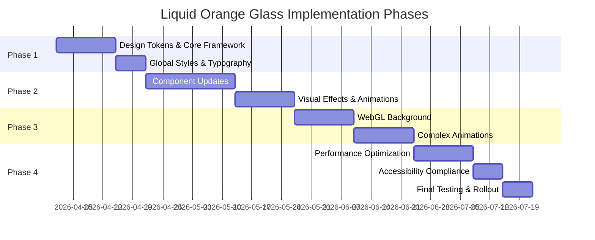
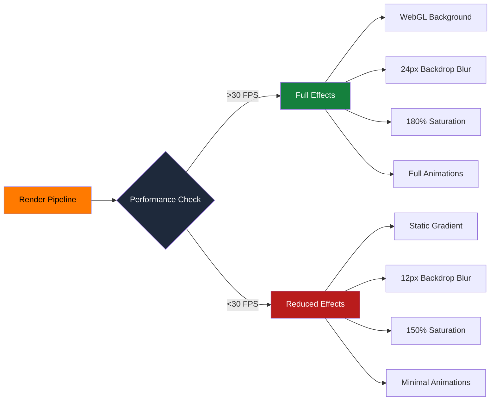
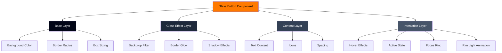

# Liquid Orange Glass Design System Architecture

## Design System Architecture

```mermaid
graph TD
    A[Liquid Orange Glass Design System] --> B[Design Tokens]
    A --> C[Core Components]
    A --> D[Visual Effects]
    A --> E[Typography System]
    A --> F[Performance Optimizations]
    A --> G[Implementation Plan]
    A --> H[Accessibility]

    %% Design Tokens
    B --> B1[Color System]
    B --> B2[Typography Scale]
    B --> B3[Shadow & Glow Effects]
    B --> B4[Spacing & Layout]

    %% Core Components
    C --> C1[Containers]
    C --> C2[Input Fields]
    C --> C3[Buttons]
    C --> C4[Cards & Panels]
    C --> C5[Modal Dialogs]
    C --> C6[Navigation]

    %% Visual Effects
    D --> D1[Backdrop Filters]
    D --> D2[Border Glow]
    D --> D3[Inset Highlights]
    D --> D4[Rim Light]
    D --> D5[Animated Gradients]

    %% Typography
    E --> E1[Primary Typography]
    E --> E2[Secondary Typography]
    E --> E3[Input Typography]
    E --> E4[PDF Typography]

    %% Performance
    F --> F1[Render Optimization]
    F --> F2[Fixed-Position Shell]
    F --> F3[Viewport Management]
    F --> F4[Contrast Compliance]

    %% Implementation
    G --> G1[Component Priority]
    G --> G2[Theme Transition]
    G --> G3[Consistency]
    G --> G4[Rollout Strategy]

    %% Accessibility
    H --> H1[Browser Fallbacks]
    H --> H2[High Contrast Mode]
    H --> H3[Screen Reader]
    H --> H4[Reduced Motion]

    style A fill:#ff7a00,color:#000
    style B fill:#1e293b,color:#fff
    style C fill:#1e293b,color:#fff
    style D fill:#1e293b,color:#fff
    style E fill:#1e293b,color:#fff
    style F fill:#1e293b,color:#fff
    style G fill:#1e293b,color:#fff
    style H fill:#1e293b,color:#fff
```

## Component Layering Structure

```mermaid
graph TB
    A[UI Layer Structure] --> B[Background Layer]
    A --> C[Container Layer]
    A --> D[Content Layer]
    A --> E[Interactive Layer]
    A --> F[Overlay Layer]

    %% Background Layer
    B --> B1[WebGL Animations]
    B --> B2[Gradient Backgrounds]
    B --> B3[Performance Monitoring]

    %% Container Layer
    C --> C1[Glass Containers]
    C --> C2[Cards & Panels]
    C --> C3[Backdrop Filters]

    %% Content Layer
    D --> D1[Typography]
    D --> D2[Static Content]
    D --> D3[Data Visualizations]

    %% Interactive Layer
    E --> E1[Input Fields]
    E --> E2[Buttons]
    E --> E3[Navigation]
    E --> E4[Rim Light Effects]

    %% Overlay Layer
    F --> F1[Modal Dialogs]
    F --> F2[Toast Notifications]
    F --> F3[Loading States]

    style A fill:#ff7a00,color:#000
    style B fill:#020617,color:#fff
    style C fill:#1e293b,color:#fff
    style D fill:#334155,color:#fff
    style E fill:#475569,color:#fff
    style F fill:#64748b,color:#fff
```

## Implementation Phases

## Visual Effects Flow

## Component Anatomy - Glass Button

