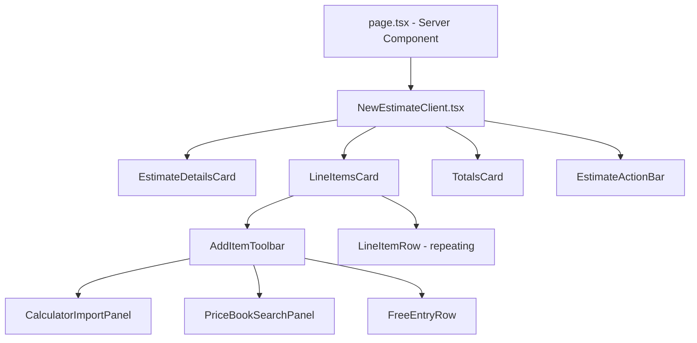
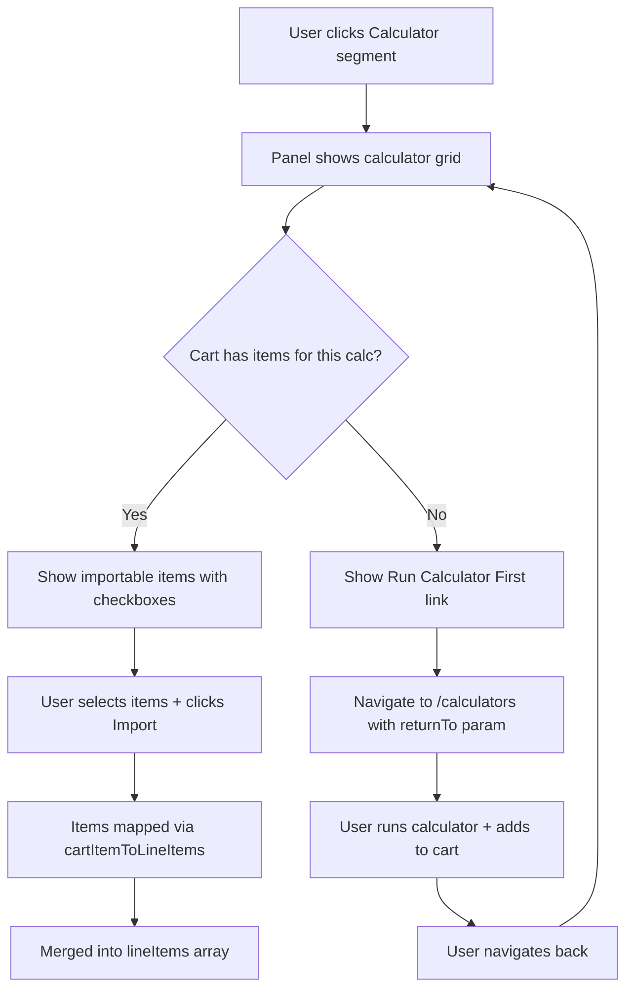
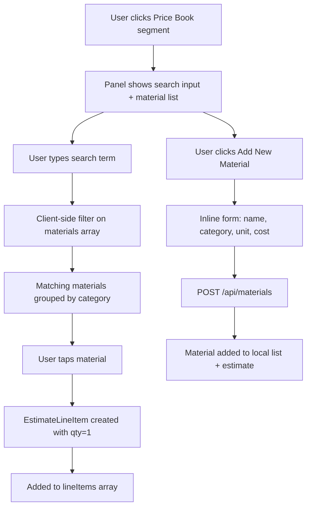
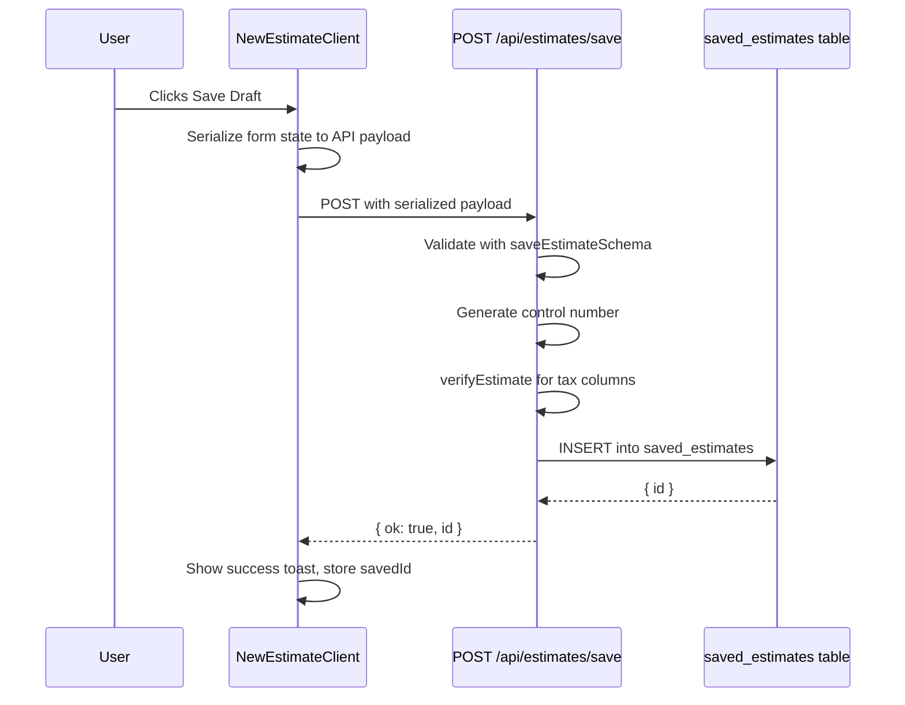
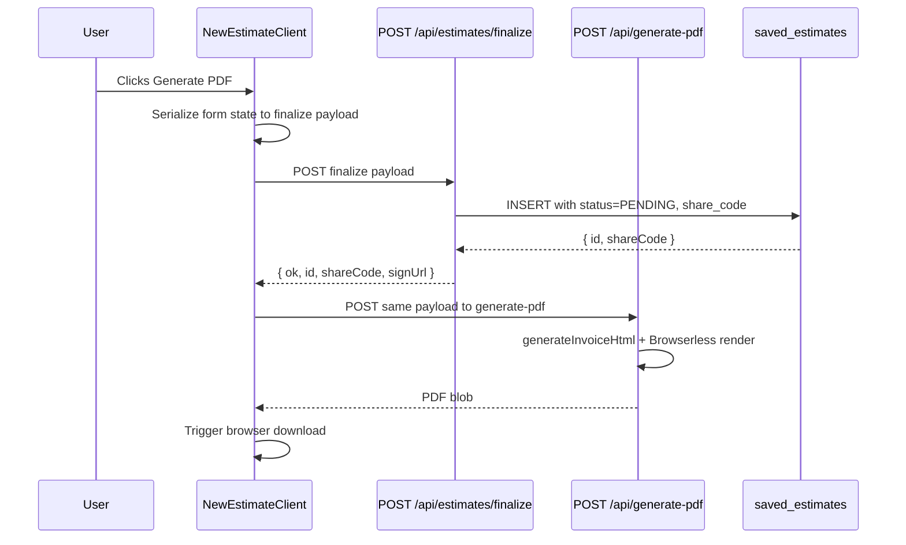
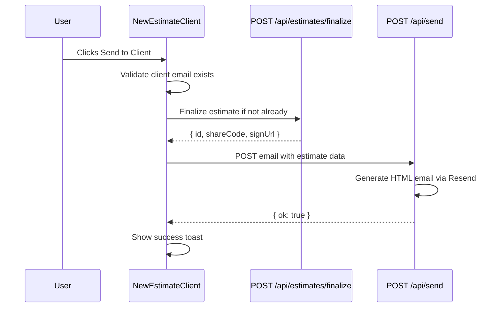

# New Estimate Creation Page — Technical Specification

> **Route:** `/command-center/estimates/new`  
> **Status:** Design specification — ready for implementation  
> **Last updated:** 2026-03-19

---

## Table of Contents

1. [Overview](#1-overview)
2. [Data Model & TypeScript Interfaces](#2-data-model--typescript-interfaces)
3. [Page Structure & Layout](#3-page-structure--layout)
4. [Component Architecture & File Map](#4-component-architecture--file-map)
5. [Three Line-Item Input Methods](#5-three-line-item-input-methods)
6. [State Management](#6-state-management)
7. [Data Flow: Create → Save → PDF → Send](#7-data-flow-create--save--pdf--send)
8. [API Integration](#8-api-integration)
9. [UX & Mobile Considerations](#9-ux--mobile-considerations)
10. [Migration & Wiring](#10-migration--wiring)
11. [Implementation Checklist](#11-implementation-checklist)

---

## 1. Overview

### Problem

The "New Estimate" button in [`CommandCenterLiteClient.tsx:186`](src/app/command-center/CommandCenterLiteClient.tsx:186) navigates to `?mode=draft` but that parameter is never consumed. All estimates currently originate from calculator results inside the 177K monolith [`CalculatorPage.tsx`](src/app/calculators/_components/CalculatorPage.tsx). There is no standalone estimate creation form.

### Solution

A dedicated estimate creation page at `/command-center/estimates/new` that provides three coexisting line-item input methods:

1. **Import from Calculator** — pull materials/quantities from any calculator run
2. **Price Book Search** — quick-add from the user's `user_materials` table
3. **Free Entry** — manual line item input

This page bridges the calculator tools with the estimate/invoicing workflow, matching the clean card-based command center design language.

### High-Level Flow

```mermaid
flowchart LR
    A[Command Center] -->|New Estimate btn| B[/command-center/estimates/new]
    B --> C{Add Line Items}
    C -->|Calculator Import| D[Select Calculator + Run]
    C -->|Price Book| E[Search user_materials]
    C -->|Free Entry| F[Manual Row Input]
    D --> G[Line Items Table]
    E --> G
    F --> G
    G --> H{Actions}
    H -->|Save Draft| I[POST /api/estimates/save]
    H -->|Finalize + PDF| J[POST /api/estimates/finalize + POST /api/generate-pdf]
    H -->|Send to Client| K[POST /api/send]
```

---

## 2. Data Model & TypeScript Interfaces

### New File: `src/lib/estimates/new-estimate-types.ts`

```typescript
import type { CalculatorId } from "@/types";

/**
 * A single line item on the estimate form.
 * This is the universal shape regardless of input method.
 */
export interface EstimateLineItem {
  /** Client-generated UUID for React key + reordering */
  id: string;
  /** Human-readable description — e.g. "2x4x8 Studs" */
  description: string;
  /** Numeric quantity — e.g. 45 */
  quantity: number;
  /** Unit label — e.g. "ea", "sq ft", "cu yd", "bag" */
  unit: string;
  /** Price per single unit in dollars — e.g. 6.00 */
  unitPrice: number;
  /** Optional freeform notes for this line */
  notes: string;
  /** Where this line item originated */
  source: LineItemSource;
  /** If sourced from price book, the user_materials row ID */
  materialId?: string;
  /** If sourced from a calculator, which one */
  calculatorId?: CalculatorId;
  /** Category tag for grouping — e.g. "Concrete", "Framing" */
  category?: string;
}

export type LineItemSource = "calculator" | "pricebook" | "manual";

/**
 * Full estimate form state — everything needed to render the page
 * and serialize to any API endpoint.
 */
export interface EstimateFormState {
  /** Estimate metadata */
  estimateName: string;
  clientName: string;
  clientEmail: string;
  projectName: string;
  jobSiteAddress: string;
  estimateDate: string; // ISO date string
  /** Auto-generated control number — PC-YYMMDDHHNN-XXXXXX */
  controlNumber: string;

  /** Line items */
  lineItems: EstimateLineItem[];

  /** Tax */
  taxRatePercent: number; // e.g. 8.75 for 8.75%
  taxCounty: string; // e.g. "oneida"

  /** Freeform notes for entire estimate */
  estimateNotes: string;

  /** Terms / conditions text */
  terms: string;
}

/**
 * Computed totals — derived, never stored in form state directly.
 */
export interface EstimateTotals {
  subtotalCents: number;
  taxCents: number;
  totalCents: number;
}

/**
 * Shape returned by a calculator import — the contract between
 * calculator output and the estimate line item list.
 */
export interface CalculatorImportResult {
  calculatorId: CalculatorId;
  calculatorLabel: string;
  /** Pre-mapped line items ready to merge into the estimate */
  lineItems: Omit<EstimateLineItem, "id">[];
  /** The primary result text for labeling — e.g. "4.5 cu yd" */
  primaryResult: { label: string; value: string | number; unit: string };
}

/**
 * A price book material row as returned from GET /api/materials.
 */
export interface PriceBookMaterial {
  id: string;
  material_name: string;
  category: string;
  unit_type: string;
  unit_cost: number;
}
```

### Mapping: Calculator Output → Estimate Line Items

The existing [`EstimateCartItem`](src/types/index.ts:71) type stores calculator results with a `materialList: string[]` (human-readable material names) plus market prices from the Zustand store. The mapping function:

```typescript
// src/lib/estimates/calculator-to-line-items.ts
import type { EstimateCartItem, MarketPrices } from "@/types";
import type { EstimateLineItem } from "./new-estimate-types";

export function cartItemToLineItems(
  cartItem: EstimateCartItem,
  marketPrices: MarketPrices,
): Omit<EstimateLineItem, "id">[] {
  return cartItem.materialList.map((materialName) => {
    const price = marketPrices[materialName];
    return {
      description: materialName,
      quantity: cartItem.quantity,
      unit: price?.unit ?? "ea",
      unitPrice: price?.price ?? 0,
      notes: `From ${cartItem.calculatorLabel}`,
      source: "calculator" as const,
      calculatorId: cartItem.calculatorId,
      category: cartItem.calculatorLabel,
    };
  });
}
```

---

## 3. Page Structure & Layout

The page follows the command center design language: white background, `rounded-2xl` cards, `border-slate-300`, orange accent color, uppercase label typography.

### Wireframe

```
┌──────────────────────────────────────────────────────────────┐
│ ← Back to Command Center          New Estimate    [Discard] │
├──────────────────────────────────────────────────────────────┤
│ ┌──────────────────────────────────────────────────────────┐ │
│ │  ESTIMATE DETAILS                              PC-XXXX  │ │
│ │  Estimate Name: [________________________]              │ │
│ │  Client Name:   [____________]  Email: [____________]   │ │
│ │  Project Name:  [____________]  Date:  [03/19/2026 ]    │ │
│ │  Job Site:      [________________________________________│ │
│ └──────────────────────────────────────────────────────────┘ │
│                                                              │
│ ┌──────────────────────────────────────────────────────────┐ │
│ │  LINE ITEMS                                              │ │
│ │  ┌─────────────────────────────────────────────────────┐ │ │
│ │  │ + Add Items  [Calculator ▾] [Price Book] [Manual +] │ │ │
│ │  └─────────────────────────────────────────────────────┘ │ │
│ │                                                          │ │
│ │  # │ Description      │ Qty │ Unit  │ Price  │ Total    │ │
│ │  ──┼──────────────────┼─────┼───────┼────────┼────────  │ │
│ │  1 │ 2x4x8 Studs      │  45 │ ea    │  $6.00 │ $270.00  │ │
│ │  2 │ OSB Sheathing     │  12 │ sheet │ $22.00 │ $264.00  │ │
│ │  3 │ Concrete Ready-Mix│ 4.5 │ cu yd │$150.00 │ $675.00  │ │
│ │  ...                                                     │ │
│ └──────────────────────────────────────────────────────────┘ │
│                                                              │
│ ┌──────────────────────────────────────────────────────────┐ │
│ │                                Subtotal:     $1,209.00   │ │
│ │  Tax County: [Oneida ▾]        Tax 8.75%:      $105.79   │ │
│ │                                ─────────────────────────  │ │
│ │                                TOTAL:        $1,314.79   │ │
│ └──────────────────────────────────────────────────────────┘ │
│                                                              │
│ ┌──────────────────────────────────────────────────────────┐ │
│ │  [Save Draft]    [Generate PDF ↓]    [Send to Client ✉] │ │
│ └──────────────────────────────────────────────────────────┘ │
└──────────────────────────────────────────────────────────────┘
```

### Section Breakdown

| Section              | Card                                       | Description                                                                     |
| -------------------- | ------------------------------------------ | ------------------------------------------------------------------------------- |
| **Header Bar**       | Sticky top bar                             | Back link, page title, discard button                                           |
| **Estimate Details** | `rounded-2xl` card                         | Metadata fields: name, client, project, date, address, auto-generated control # |
| **Line Items**       | `rounded-2xl` card                         | Add-item toolbar + scrollable line items table                                  |
| **Totals**           | `rounded-2xl` card                         | Subtotal, tax selector, tax amount, grand total                                 |
| **Action Bar**       | Sticky bottom on mobile, inline on desktop | Save Draft, Generate PDF, Send to Client                                        |

---

## 4. Component Architecture & File Map

### New Directory Structure

```
src/app/command-center/estimates/
├── new/
│   ├── page.tsx                          # Server component — auth gate, data fetch
│   └── NewEstimateClient.tsx             # Client component — full page orchestrator
│
src/components/estimates/
├── EstimateDetailsCard.tsx               # Metadata form fields
├── LineItemsCard.tsx                     # Line items table + add-item toolbar
├── LineItemRow.tsx                       # Single editable row in the table
├── AddItemToolbar.tsx                    # Unified toolbar with 3 input method tabs
├── CalculatorImportPanel.tsx             # Calculator selection + import flow
├── PriceBookSearchPanel.tsx              # Searchable price book with quick-add
├── FreeEntryRow.tsx                      # Inline manual entry form
├── TotalsCard.tsx                        # Subtotal / tax / total display
├── EstimateActionBar.tsx                 # Save / PDF / Send buttons
└── hooks/
    ├── useEstimateForm.ts                # Core form state hook with useReducer
    ├── usePriceBookSearch.ts             # Debounced search + fetch from /api/materials
    └── useEstimateActions.ts             # Save/finalize/PDF/send API calls
```

### Component Hierarchy



### Component Specifications

#### `page.tsx` — Server Component

**Path:** `src/app/command-center/estimates/new/page.tsx`

Responsibilities:

- Auth gate via `auth()` — redirect to sign-in if unauthenticated
- Fetch business profile for branding (contractor name, logo)
- Fetch price book materials via direct Supabase query (for SSR)
- Pass data to `NewEstimateClient`

```typescript
// Pseudocode structure
export default async function NewEstimatePage() {
  const session = await auth();
  if (!session?.user?.id) redirect(routes.auth.signIn);

  const db = createServerClient();
  const businessContext = await getBusinessContextForSession(db, session);
  const materials = await fetchMaterials(db, businessContext);
  const businessProfile = await fetchBusinessProfile(db, businessContext);

  return (
    <>
      <Header />
      <NewEstimateClient
        initialMaterials={materials}
        businessProfile={businessProfile}
      />
    </>
  );
}
```

#### `NewEstimateClient.tsx` — Client Orchestrator

**Path:** `src/app/command-center/estimates/new/NewEstimateClient.tsx`

Responsibilities:

- Houses the `useEstimateForm` reducer for all form state
- Computes totals reactively via `useMemo`
- Coordinates between child components
- Handles dirty-state warning on navigation

#### `EstimateDetailsCard.tsx`

**Path:** `src/components/estimates/EstimateDetailsCard.tsx`

Props:

```typescript
interface EstimateDetailsCardProps {
  estimateName: string;
  clientName: string;
  clientEmail: string;
  projectName: string;
  jobSiteAddress: string;
  estimateDate: string;
  controlNumber: string;
  onUpdate: (field: string, value: string) => void;
}
```

Design notes:

- 2-column grid on desktop (`sm:grid-cols-2`), single column on mobile
- Control number displayed as monospace read-only badge
- Date field uses native `<input type="date">` for mobile date pickers

#### `LineItemsCard.tsx`

**Path:** `src/components/estimates/LineItemsCard.tsx`

Props:

```typescript
interface LineItemsCardProps {
  lineItems: EstimateLineItem[];
  onAddItems: (items: Omit<EstimateLineItem, "id">[]) => void;
  onUpdateItem: (id: string, patch: Partial<EstimateLineItem>) => void;
  onRemoveItem: (id: string) => void;
  onReorderItems: (fromIndex: number, toIndex: number) => void;
  initialMaterials: PriceBookMaterial[];
}
```

Design notes:

- Responsive table: full columns on desktop, stacked card layout on mobile
- Drag handles for reordering (optional, can be Phase 2)
- Swipe-to-delete on mobile (optional, can be Phase 2)
- Each row shows: line number, description, qty, unit, unit price, line total, delete button

#### `AddItemToolbar.tsx`

**Path:** `src/components/estimates/AddItemToolbar.tsx`

The unified entry point for all three input methods. Uses a **segmented control** (not tabs — feels less fragmented) with three options:

```
[🧮 Calculator] [📖 Price Book] [✏️ Manual]
```

- Clicking a segment reveals its panel below the toolbar
- Panel is collapsible — click same segment again to hide
- On mobile, the segmented control becomes a dropdown to save horizontal space

#### `CalculatorImportPanel.tsx`

**Path:** `src/components/estimates/CalculatorImportPanel.tsx`

Two-step flow:

1. **Select calculator** — grid of calculator cards (from `CALCULATORS` data)
2. **Import results** — shows the current Zustand cart items for that calculator, user confirms which to import

Props:

```typescript
interface CalculatorImportPanelProps {
  onImport: (items: Omit<EstimateLineItem, "id">[]) => void;
  onClose: () => void;
}
```

**Key design decision:** Does NOT open the calculator in a modal. Instead:

- Shows items currently in the Zustand `estimateCart` filtered by calculator
- Has a "Run Calculator First →" link that navigates to `/calculators?c={category}` with a `returnTo` query param
- When user returns, their cart items are available for import

#### `PriceBookSearchPanel.tsx`

**Path:** `src/components/estimates/PriceBookSearchPanel.tsx`

Props:

```typescript
interface PriceBookSearchPanelProps {
  materials: PriceBookMaterial[];
  onAdd: (item: Omit<EstimateLineItem, "id">) => void;
  onClose: () => void;
}
```

Features:

- Client-side search filter on `material_name` and `category`
- Grouped by category with collapsible sections
- Each material shows: name, unit, unit price
- Click/tap adds to estimate with qty=1 (editable in the table afterward)
- "Add New Material" button at bottom → inline form that POSTs to `/api/materials` and adds to both price book and estimate
- Debounced search input with `usePriceBookSearch` hook

#### `FreeEntryRow.tsx`

**Path:** `src/components/estimates/FreeEntryRow.tsx`

Props:

```typescript
interface FreeEntryRowProps {
  onAdd: (item: Omit<EstimateLineItem, "id">) => void;
}
```

Features:

- Inline form at the bottom of the line items table
- Fields: Description, Qty, Unit, Unit Price, Notes
- Enter key submits and clears for rapid entry
- Tab key moves between fields
- Minimal chrome — just input fields with placeholder text

#### `TotalsCard.tsx`

**Path:** `src/components/estimates/TotalsCard.tsx`

Props:

```typescript
interface TotalsCardProps {
  subtotalCents: number;
  taxCents: number;
  totalCents: number;
  taxRatePercent: number;
  taxCounty: string;
  onTaxChange: (county: string, ratePercent: number) => void;
}
```

Features:

- Right-aligned totals
- County dropdown with pre-configured rates (Oneida 8.75%, Herkimer 8.25%, Madison 8.00%, Custom)
- Custom tax rate input when "Custom" selected
- "No tax" option (0%)

#### `EstimateActionBar.tsx`

**Path:** `src/components/estimates/EstimateActionBar.tsx`

Props:

```typescript
interface EstimateActionBarProps {
  onSaveDraft: () => Promise<void>;
  onGeneratePdf: () => Promise<void>;
  onSendToClient: () => Promise<void>;
  isSaving: boolean;
  isGeneratingPdf: boolean;
  isSending: boolean;
  hasLineItems: boolean;
  hasClientEmail: boolean;
}
```

Features:

- Three action buttons: Save Draft (primary), Generate PDF (secondary), Send to Client (secondary)
- Send to Client disabled if no client email
- Generate PDF / Send disabled if no line items
- Loading spinners on each button during async operations
- On mobile: sticky bottom bar with full-width buttons stacked vertically

---

## 5. Three Line-Item Input Methods

### Method 1: Calculator Import



**Data contract:** Calculator results flow through the existing Zustand `estimateCart` array. Each [`EstimateCartItem`](src/types/index.ts:71) has:

- `calculatorId` / `calculatorLabel` — which calculator produced it
- `materialList: string[]` — human-readable material names
- `primaryResult` — the headline number (e.g., "4.5 cu yd")
- `quantity` — user-specified multiplier

The [`cartItemToLineItems()`](src/lib/estimates/calculator-to-line-items.ts) function maps these into `EstimateLineItem[]` using `MARKET_PRICES_BASE` for unit costs.

### Method 2: Price Book Search



**Data source:** Price book materials are fetched server-side in `page.tsx` from `user_materials` table and passed as `initialMaterials` prop. The shape matches [`PriceBookMaterial`](#new-file-srclibEstimatesnew-estimate-typests) above. Fields from the DB:

| Column          | Type    | Maps to                   |
| --------------- | ------- | ------------------------- |
| `id`            | uuid    | `materialId` on line item |
| `material_name` | text    | `description`             |
| `category`      | text    | `category`                |
| `unit_type`     | text    | `unit`                    |
| `unit_cost`     | numeric | `unitPrice`               |

### Method 3: Free Entry

The simplest method — an always-visible inline form row at the bottom of the line items table (when Manual segment is active).

Field layout on desktop: `[Description] [Qty] [Unit ▾] [Unit Price] [Notes] [+ Add]`

Common unit presets in dropdown: `ea`, `sq ft`, `cu yd`, `lf`, `bag`, `bundle`, `sheet`, `gal`, `box`, `hr`

**Keyboard flow:** Tab through fields → Enter to add → focus returns to Description field.

---

## 6. State Management

### Approach: Local `useReducer` — NOT Zustand

The estimate form state is page-local. It does not need to persist across page navigations or be shared with other pages. Using Zustand for this would pollute the global store with transient form data.

**Exception:** The existing Zustand `estimateCart` is READ from (for calculator import) but not written to by this page.

### `useEstimateForm` Hook

**Path:** `src/components/estimates/hooks/useEstimateForm.ts`

```typescript
type EstimateFormAction =
  | {
      type: "SET_FIELD";
      field: keyof EstimateFormState;
      value: string | number;
    }
  | { type: "ADD_LINE_ITEMS"; items: Omit<EstimateLineItem, "id">[] }
  | { type: "UPDATE_LINE_ITEM"; id: string; patch: Partial<EstimateLineItem> }
  | { type: "REMOVE_LINE_ITEM"; id: string }
  | { type: "REORDER_LINE_ITEMS"; fromIndex: number; toIndex: number }
  | { type: "SET_TAX"; county: string; ratePercent: number }
  | { type: "RESET" };

function estimateFormReducer(
  state: EstimateFormState,
  action: EstimateFormAction,
): EstimateFormState {
  /* ... */
}

export function useEstimateForm(initialState?: Partial<EstimateFormState>) {
  const [state, dispatch] = useReducer(estimateFormReducer, {
    ...defaultEstimateFormState,
    ...initialState,
  });

  const totals = useMemo<EstimateTotals>(() => {
    const subtotalCents = state.lineItems.reduce(
      (sum, item) => sum + Math.round(item.quantity * item.unitPrice * 100),
      0,
    );
    const taxCents = Math.round(subtotalCents * (state.taxRatePercent / 100));
    return { subtotalCents, taxCents, totalCents: subtotalCents + taxCents };
  }, [state.lineItems, state.taxRatePercent]);

  return { state, dispatch, totals };
}
```

### `useEstimateActions` Hook

**Path:** `src/components/estimates/hooks/useEstimateActions.ts`

Encapsulates all API calls:

```typescript
export function useEstimateActions(
  state: EstimateFormState,
  totals: EstimateTotals,
) {
  const [saving, setSaving] = useState(false);
  const [generatingPdf, setGeneratingPdf] = useState(false);
  const [sending, setSending] = useState(false);

  async function saveDraft(): Promise<{ id: string } | null> {
    /* ... */
  }
  async function finalize(): Promise<{ id: string; shareCode: string } | null> {
    /* ... */
  }
  async function generatePdf(): Promise<Blob | null> {
    /* ... */
  }
  async function sendToClient(): Promise<boolean> {
    /* ... */
  }

  return {
    saveDraft,
    finalize,
    generatePdf,
    sendToClient,
    saving,
    generatingPdf,
    sending,
  };
}
```

---

## 7. Data Flow: Create → Save → PDF → Send

### 7.1 Save Draft



**Serialization — form state → save API payload:**

```typescript
function serializeForSave(state: EstimateFormState, totals: EstimateTotals) {
  return {
    name: state.estimateName || "Untitled Estimate",
    calculator_id: "manual/estimate-builder",
    client_name: state.clientName || null,
    job_site_address: state.jobSiteAddress || null,
    total_cost: totals.totalCents / 100,
    status: "Draft",
    results: state.lineItems.map((item) => ({
      label: item.description,
      value: item.quantity * item.unitPrice,
      unit: item.unit,
    })),
    inputs: {
      control_number: state.controlNumber,
      client_email: state.clientEmail || null,
      project_name: state.projectName || null,
      estimate_date: state.estimateDate,
      estimate_notes: state.estimateNotes || null,
      terms: state.terms || null,
      tax_county: state.taxCounty || null,
      custom_basis_points: Math.round(state.taxRatePercent * 100),
      subtotal_cents: totals.subtotalCents,
      tax_cents: totals.taxCents,
      total_cents: totals.totalCents,
      line_items: state.lineItems,
    },
    budget_items: state.lineItems.map((item) => ({
      id: item.id,
      name: item.description,
      quantity: item.quantity,
      unit: item.unit,
      pricePerUnit: item.unitPrice,
    })),
  };
}
```

**Why `calculator_id: 'manual/estimate-builder'`?** The existing schema requires a `calculator_id` string. Using a namespaced value distinguishes manually-built estimates from calculator-generated ones.

### 7.2 Finalize + Generate PDF



**Serialization — form state → finalize API payload:**

```typescript
function serializeForFinalize(
  state: EstimateFormState,
  totals: EstimateTotals,
) {
  return {
    name: state.estimateName || "Untitled Estimate",
    calculator_id: "manual/estimate-builder",
    client_name: state.clientName || null,
    job_site_address: state.jobSiteAddress || null,
    total_cost: totals.totalCents / 100,
    results: state.lineItems.map((item) => ({
      label: item.description,
      value: item.quantity * item.unitPrice,
      unit: item.unit,
    })),
    material_list: state.lineItems.map((item) => {
      const lineTotal = (item.quantity * item.unitPrice).toFixed(2);
      return `${item.description} — ${item.quantity} ${item.unit} × $${item.unitPrice.toFixed(2)} = $${lineTotal}`;
    }),
    inputs: {
      control_number: state.controlNumber,
      client_email: state.clientEmail || null,
      project_name: state.projectName || null,
      selected_county: state.taxCounty || null,
      custom_basis_points: Math.round(state.taxRatePercent * 100),
      subtotal_cents: totals.subtotalCents,
      tax_cents: totals.taxCents,
      total_cents: totals.totalCents,
      line_items: state.lineItems,
    },
    metadata: {
      title: state.estimateName || "Estimate",
      calculatorLabel: "Estimate Builder",
      generatedAt: new Date().toISOString(),
      jobName: state.projectName || state.estimateName || null,
    },
  };
}
```

### 7.3 Send to Client



The send flow uses the existing [`POST /api/send`](src/app/api/send/route.ts) endpoint with the `estimate` payload shape.

---

## 8. API Integration

### Existing Endpoints Used (No Changes Needed)

| Endpoint                                                             | Method | Usage                          |
| -------------------------------------------------------------------- | ------ | ------------------------------ |
| [`/api/estimates/save`](src/app/api/estimates/save/route.ts)         | POST   | Save draft estimate            |
| [`/api/estimates/finalize`](src/app/api/estimates/finalize/route.ts) | POST   | Finalize with share code       |
| [`/api/estimates/[id]`](src/app/api/estimates/[id]/route.ts)         | PATCH  | Update existing draft          |
| [`/api/generate-pdf`](src/app/api/generate-pdf/route.ts)             | POST   | Generate PDF via Browserless   |
| [`/api/send`](src/app/api/send/route.ts)                             | POST   | Email estimate to client       |
| [`/api/materials`](src/app/api/materials/route.ts)                   | GET    | Fetch price book               |
| [`/api/materials`](src/app/api/materials/route.ts)                   | POST   | Add new material to price book |

### New `calculator_id` Value

The new page uses `calculator_id: 'manual/estimate-builder'` to distinguish manually-created estimates. This value should be:

- Added to the [`CalculatorId`](src/types/index.ts:3) union type or treated as a string passthrough (current API accepts any string up to 100 chars)
- Displayed as "Estimate Builder" in the saved estimates list

### Route Registration

Add to [`src/app/routes.ts`](src/app/routes.ts):

```typescript
export const routes = {
  // ... existing routes
  newEstimate: "/command-center/estimates/new" as Route,
} as const;
```

---

## 9. UX & Mobile Considerations

### Mobile-First Design Priorities

1. **Sticky action bar** — Save/PDF/Send always visible at bottom of viewport on mobile
2. **Stacked card layout** for line items on screens `< 768px` instead of wide table
3. **Native date picker** via `<input type="date">`
4. **Touch-friendly targets** — all interactive elements min 44px height
5. **Segmented control → dropdown** for input method selector on narrow screens

### Fast Input Patterns

| Pattern                 | Implementation                                                         |
| ----------------------- | ---------------------------------------------------------------------- |
| Enter to add next       | Free entry row: Enter submits, clears, re-focuses description          |
| Tab cycling             | Tab order flows: Description → Qty → Unit → Price → Notes → Add button |
| Quick quantity edit     | Inline number input in line items table — click to edit                |
| Price book one-tap      | Tapping a material adds it immediately with qty=1                      |
| Batch calculator import | Checkboxes + "Import Selected" for multiple items at once              |

### Visual Hierarchy

| Priority          | Element                 | Treatment                              |
| ----------------- | ----------------------- | -------------------------------------- |
| **1 — Scannable** | Line items total column | Bold, right-aligned, monospace numbers |
| **2 — Scannable** | Grand total             | Large text, orange accent              |
| **3 — Editable**  | Line item quantities    | Highlighted input borders              |
| **4 — Reference** | Control number, date    | Muted, monospace                       |
| **5 — Secondary** | Notes, terms            | Collapsed by default                   |

### Empty States

- **No line items:** Centered illustration + "Add your first item using the toolbar above"
- **No price book materials:** "Your price book is empty. Add materials in Price Book settings or enter items manually."
- **No calculator results:** "Run a calculator first, then import results here."

### Dirty State Protection

`beforeunload` event listener when form has unsaved changes. Also `next/navigation`'s `useRouter` interception pattern for client-side navigation.

---

## 10. Migration & Wiring

### Step 1: Update "New Estimate" Button

In [`CommandCenterLiteClient.tsx:186`](src/app/command-center/CommandCenterLiteClient.tsx:186), change the link target:

```diff
- href={`${routes.commandCenter}?mode=draft`}
+ href={routes.newEstimate}
```

### Step 2: Add Route

In [`src/app/routes.ts`](src/app/routes.ts):

```diff
  commandCenter: "/command-center" as Route,
+ newEstimate: "/command-center/estimates/new" as Route,
```

### Step 3: Protected Route

The `/command-center` route is already protected in [`protectedRoutes`](src/app/routes.ts:41). The new page is nested under it, so it inherits protection. Verify middleware handles nested paths.

---

## 11. Implementation Checklist

### Phase 1 — Core Page (MVP)

- [ ] Create `src/app/command-center/estimates/new/page.tsx` — server component with auth gate
- [ ] Create `src/app/command-center/estimates/new/NewEstimateClient.tsx` — client orchestrator
- [ ] Create `src/lib/estimates/new-estimate-types.ts` — TypeScript interfaces
- [ ] Create `src/components/estimates/hooks/useEstimateForm.ts` — form state reducer
- [ ] Create `src/components/estimates/EstimateDetailsCard.tsx` — metadata form
- [ ] Create `src/components/estimates/LineItemsCard.tsx` — line items table
- [ ] Create `src/components/estimates/LineItemRow.tsx` — editable row
- [ ] Create `src/components/estimates/FreeEntryRow.tsx` — manual entry
- [ ] Create `src/components/estimates/TotalsCard.tsx` — totals display
- [ ] Create `src/components/estimates/EstimateActionBar.tsx` — action buttons
- [ ] Create `src/components/estimates/hooks/useEstimateActions.ts` — API integration
- [ ] Update `src/app/routes.ts` — add `newEstimate` route
- [ ] Update `CommandCenterLiteClient.tsx` — rewire "New Estimate" button

### Phase 2 — Input Methods

- [ ] Create `src/components/estimates/AddItemToolbar.tsx` — segmented control
- [ ] Create `src/components/estimates/PriceBookSearchPanel.tsx` — price book search
- [ ] Create `src/components/estimates/hooks/usePriceBookSearch.ts` — search hook
- [ ] Create `src/components/estimates/CalculatorImportPanel.tsx` — calculator import
- [ ] Create `src/lib/estimates/calculator-to-line-items.ts` — cart-to-line-item mapper

### Phase 3 — Polish

- [ ] Dirty state protection (beforeunload + router interception)
- [ ] Mobile responsive: stacked card layout for line items
- [ ] Mobile responsive: sticky bottom action bar
- [ ] Empty states for all three panels
- [ ] Inline "Add New Material" form in price book panel
- [ ] Toast notifications for save/send success/failure
- [ ] Loading skeletons during initial data fetch
- [ ] Drag-to-reorder line items (optional)

### Phase 4 — Edit Existing Estimate

- [ ] Create `/command-center/estimates/[id]/edit` route
- [ ] Load existing estimate data into form state
- [ ] Use PATCH `/api/estimates/[id]` for updates instead of POST save
